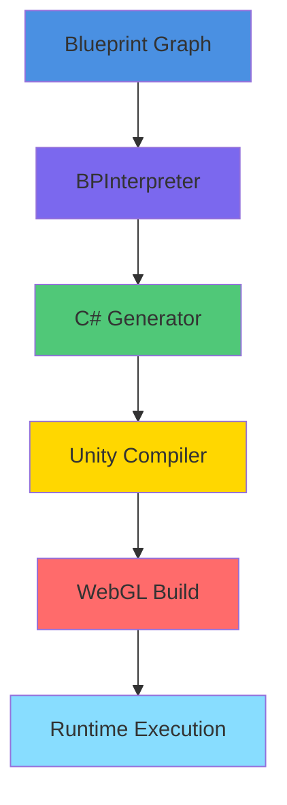
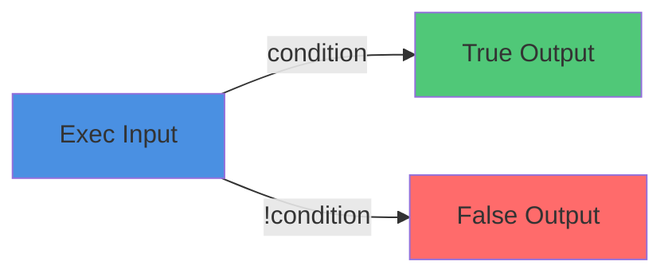

# ⭐ PHASE 6.5 — Cross-Subsystem Linking & Interactive Diagram System

**Dynamic IDE Knowledge Portal for WISSIL/LUMINES**

*Last updated: December 2024*

---

## 📘 Overview

Phase 6.5 upgrades Storybook from static documentation into a **living, interactive engineering atlas**, where diagrams, subsystem pages, blueprints, Unity WebGL, and Storybook components all cross-reference each other and sync automatically.

**Modeled after:**
- ✅ Figma Developer Platform
- ✅ Unity DOTS TechDocs
- ✅ StackBlitz DevTools
- ✅ Shopify Polaris Engineering Diagrams
- ✅ Unreal Engine documentation portal
- ✅ Vercel design system

---

## 🎯 Purpose

Phase 6.5 ensures:

- ✅ Ignis Node Editor docs link to actual running graphs
- ✅ Spark templates embed rendered graphs
- ✅ Ignition build UI links to live build pipeline graphs
- ✅ Unity Tools include interactive overlays
- ✅ Subsystem diagrams render as clickable maps
- ✅ Blueprint diagrams sync with Node Library stories
- ✅ System architecture maps are interactive SVGs
- ✅ All components cross-link between subsystems automatically
- ✅ LUNA can read + generate diagram metadata

---

# 🧩 6.5.1 — Interactive Architecture Map in Storybook Sidebar

**File:** `apps/storybook/docs/overview/SubsystemMap.mdx`

Embed clickable diagrams that open subsystem pages:

```mdx
import { Meta } from '@storybook/addon-docs';
import SubsystemMap from '../assets/SUBSYSTEM_VISUAL_COVERAGE_MAP.svg';

<Meta title="WISSIL/Architecture Map" />

# WISSIL Architecture Map

<SubsystemMap />

---

## Subsystem Navigation

Click any subsystem to jump directly to its Storybook docs:

- [Slate](../slate/index.mdx) - Design System
- [Ignis](../ignis/index.mdx) - Blueprint Editor
- [Spark](../spark/index.mdx) - Template System
- [Ignition](../ignition/index.mdx) - Runtime & Hot Reload
- [Unity Tools](../unity-tools/index.mdx) - Editor Tools
- [Waypoint](../waypoint/index.mdx) - AI Assistant

## Interactive Regions

The architecture diagram above contains clickable regions that navigate to each subsystem's documentation.
```

**Add clickable zones to SVG:**

```svg
<a href="/?path=/docs/slate--docs">
  <rect x="100" y="100" width="200" height="150" fill="transparent" cursor="pointer" />
</a>

<a href="/?path=/docs/ignis--docs">
  <rect x="580" y="330" width="420" height="230" fill="transparent" cursor="pointer" />
</a>
```

**Result:** The entire architecture diagram becomes a **navigation router** for the IDE docs.

---

# 🧩 6.5.2 — Live Ignis Blueprint Graphs Embedded in Docs

**File:** `apps/storybook/docs/components/InteractiveGraph.mdx`

Add a reusable MDX component:

```mdx
import React from 'react';
import { BPGraphCanvas } from '@wissil/ignis/blueprint/canvas/BPGraphCanvas';
import { useBPGraphStore } from '@wissil/ignis/blueprint/store/BPGraphStore';

export const GraphDemo = ({ graph, readOnly = true }) => {
  const store = useBPGraphStore();
  
  React.useEffect(() => {
    if (graph) {
      store.loadGraph(graph);
    }
  }, [graph, store]);

  return (
    <div style={{ 
      height: "600px", 
      border: "1px solid var(--slate-border)", 
      borderRadius: 8,
      background: "var(--slate-bg)"
    }}>
      <BPGraphCanvas />
    </div>
  );
};
```

**Then in docs:**

```mdx
import { GraphDemo } from '../components/InteractiveGraph';
import { branchExampleGraph } from '../examples/graphs';

# Branch Node

## Interactive Example

<GraphDemo graph={branchExampleGraph} readOnly />

This graph demonstrates the Branch node's conditional execution flow.
```

**Result:**
- ✅ MDX docs show **actual executable graphs**
- ✅ Users can inspect nodes, wires, flow paths
- ✅ Chromatic snapshots validate styling but disable interactions

---

# 🧩 6.5.3 — Interactive Spark Template Docs

**File:** `apps/storybook/docs/spark/card-game-template.mdx`

Every Spark template renders its default blueprint:

```mdx
import { Meta } from '@storybook/addon-docs';
import { GraphDemo } from '../components/InteractiveGraph';
import { cardGameTemplateGraph } from '../../examples/templates/card-game';

<Meta title="Spark/Card Game Template" />

# Card Game Template

## Template Overview

This template includes turn order, play zones, score logic.

<GraphDemo graph={cardGameTemplateGraph} readOnly />

## Nodes Included

- Sequence - Turn order management
- OnStart - Game initialization
- CallMethod - Card play logic
- Branch - Win/lose conditions
- Custom event nodes - Card-specific events

## Usage

1. Load template from Spark browser
2. Customize card rules
3. Export to Unity project
```

**Now Spark becomes visually inspectable.**

---

# 🧩 6.5.4 — Unity WebGL Runtime Preview Embedded in Docs

**File:** `apps/storybook/docs/components/UnityRuntimePreview.mdx`

Update `.storybook/preview.ts` to allow iframe hydration.

Add an MDX component:

```mdx
import React from 'react';

export const UnityRuntimePreview = ({ buildUrl, width = "100%", height = "600px" }) => (
  <div style={{ 
    border: "1px solid var(--slate-border)", 
    borderRadius: 8,
    overflow: "hidden",
    margin: "16px 0"
  }}>
    <iframe
      src={buildUrl}
      width={width}
      height={height}
      style={{ 
        border: 0, 
        display: "block"
      }}
      title="Unity WebGL Runtime Preview"
      allow="autoplay; fullscreen"
    />
  </div>
);
```

**Then use it:**

```mdx
import { UnityRuntimePreview } from '../components/UnityRuntimePreview';

# Runtime Build (Ignition)

## Live Preview

<UnityRuntimePreview buildUrl="/unity-builds/sample/index.html" />

This shows the actual Unity WebGL runtime running in the browser.
```

**Result:** Your IGNITION subsystem has **interactive previews inside documentation**.

---

# 🧩 6.5.5 — Interactive Unity Tooling Panels

**File:** `apps/storybook/docs/components/UnityToolPanel.mdx`

Unity Tools (SceneGraph, Prefabs, Canvas, Shader) already have React components.

Embed each tool directly:

```mdx
import React from 'react';
import { SceneGraphPanel } from '@wissil/unity-tools/scene-graph/SceneGraphPanel';

export const SceneGraphDemo = ({ project = "demoScene", readOnly = true }) => (
  <div style={{ 
    height: "600px", 
    border: "1px solid var(--slate-border)", 
    borderRadius: 8,
    background: "var(--slate-bg)"
  }}>
    <SceneGraphPanel 
      project={project} 
      readOnly={readOnly}
    />
  </div>
);
```

**Create interactive documentation for:**

- SceneGraph hierarchy
- Prefab Inspector
- Prefab Variants System
- Shader Graph
- Animation Timeline
- Material Editor
- Lighting Editor
- UI Canvas Editor

**Example usage:**

```mdx
# SceneGraph Inspector

## Interactive Preview

<SceneGraphDemo project="demoScene" readOnly />

This shows the live SceneGraph hierarchy for the demo scene.
```

**This mirrors Unity Docs — but in your Storybook.**

---

# 🧩 6.5.6 — Cross-Subsystem Linking Engine

**File:** `apps/storybook/docs/components/LinkCard.mdx`

Add custom MDX shortcodes:

```mdx
import React from 'react';

export const LinkCard = ({ title, href, description, icon }) => (
  <a 
    href={href}
    style={{
      display: 'block',
      padding: '16px',
      border: '1px solid var(--slate-border)',
      borderRadius: 8,
      textDecoration: 'none',
      color: 'var(--slate-text)',
      marginBottom: 12,
      transition: 'all 0.2s',
      background: 'var(--slate-panel)'
    }}
    onMouseEnter={(e) => {
      e.currentTarget.style.borderColor = 'var(--slate-accent)';
      e.currentTarget.style.background = 'var(--slate-bg)';
    }}
    onMouseLeave={(e) => {
      e.currentTarget.style.borderColor = 'var(--slate-border)';
      e.currentTarget.style.background = 'var(--slate-panel)';
    }}
  >
    <h3 style={{ margin: '0 0 8px 0', fontSize: '18px' }}>{icon} {title}</h3>
    <p style={{ margin: 0, color: 'var(--slate-text-muted)', fontSize: '14px' }}>
      {description}
    </p>
  </a>
);
```

**Now document cross-links:**

```mdx
import { LinkCard } from '../components/LinkCard';

# Ignis Node Pipeline

## Related Documentation

<LinkCard 
  href="/?path=/docs/spark--docs" 
  title="Spark Templates"
  description="See how nodes are used in template starter graphs."
  icon="✨"
/>

<LinkCard 
  href="/?path=/docs/ignition--docs" 
  title="Ignition Runtime"
  description="Learn how C# generation hooks into WebGL runtime."
  icon="⚡"
/>

<LinkCard 
  href="/?path=/docs/unity-tools--docs" 
  title="Unity Tools"
  description="Inspect nodes that interact with SceneGraph and Prefabs."
  icon="🛠️"
/>
```

**This creates Storybook-level knowledge routing.**

---

# 🧩 6.5.7 — Interactive Diagrams using Mermaid JS

**Install:**

```bash
npm install @mermaid-js/mermaid @storybook/addon-docs
```

**Add to Storybook MDX:**

````mdx
# Execution Flow

## Blueprint Compilation Pipeline


````

**You can build:**

- Execution path diagrams
- Blueprint compilation flow
- C# generation pipeline
- Unity runtime event propagation
- Subsystem dependency graphs

---

# 🧩 6.5.8 — Interactive Blueprint Node Library Docs

**File:** `apps/storybook/docs/ignis/nodes/branch-node.mdx`

Every Node Library entry now shows:

1. NodeRenderer preview
2. Example graph snippet
3. Mermaid flowchart
4. Live node props editor
5. Link to Unity C# code generation
6. Link to Unity Runtime invocation
7. Link to Spark template usage

**Example:**

```mdx
import { Meta, Story, Canvas, ArgsTable } from '@storybook/addon-docs';
import { NodeRenderer } from '@wissil/ignis/blueprint/canvas/NodeRenderer';
import { GraphDemo } from '../components/InteractiveGraph';
import { LinkCard } from '../components/LinkCard';
import { branchNodeExample } from '../../examples/nodes/branch';

<Meta title="Ignis/Nodes/Branch" />

# Branch Node

## Visual Preview

<Canvas>
  <Story name="Branch Node">
    <NodeRenderer 
      node={branchNodeExample} 
      isSelected={false}
      onDragStart={() => {}}
      onSocketClick={() => {}}
    />
  </Story>
</Canvas>

## Logic Flow



## Interactive Example

<GraphDemo graph={branchNodeExampleGraph} readOnly />

## Props

<ArgsTable of={NodeRenderer} />

## Used In

<LinkCard 
  href="/?path=/docs/spark-cardgame--docs" 
  title="Card Game Template"
  description="Used for win/lose condition checks."
  icon="🎮"
/>

<LinkCard 
  href="/?path=/docs/ignis-debugger--docs" 
  title="Debugger Flow"
  description="Conditional breakpoint logic."
  icon="🐛"
/>

## C# Generation

The Branch node generates:

```csharp
if (condition) {
    // True branch
} else {
    // False branch
}
```

## Runtime Behavior

When executed, the Branch node evaluates the condition and routes execution to either the True or False output.
```

---

# 🧩 6.5.9 — LUNA-Driven Interactive Docs

**File:** `apps/storybook/docs/components/LunaGeneratedExample.mdx`

This is the **AI layer**.

Create:

```mdx
import React, { useState } from 'react';

export const LunaGeneratedExample = ({ prompt, initialContent }) => {
  const [content, setContent] = useState(initialContent);
  const [loading, setLoading] = useState(false);

  const generate = async () => {
    setLoading(true);
    // Call LUNA API
    const response = await fetch('/api/luna/generate-doc', {
      method: 'POST',
      body: JSON.stringify({ prompt }),
    });
    const data = await response.json();
    setContent(data.content);
    setLoading(false);
  };

  return (
    <div style={{ 
      border: "1px solid var(--slate-border)", 
      borderRadius: 8,
      padding: "16px",
      background: "var(--slate-panel)"
    }}>
      <div style={{ marginBottom: "12px" }}>
        <button 
          onClick={generate}
          disabled={loading}
          style={{
            padding: "8px 16px",
            background: "var(--slate-accent)",
            color: "white",
            border: "none",
            borderRadius: 4,
            cursor: loading ? "not-allowed" : "pointer"
          }}
        >
          {loading ? "Generating..." : "Generate with LUNA"}
        </button>
      </div>
      <div dangerouslySetInnerHTML={{ __html: content }} />
    </div>
  );
};
```

**And embed a LUNA-generated diagram:**

```mdx
import { LunaGeneratedExample } from '../components/LunaGeneratedExample';

# LUNA Auto-Documentation

## AI-Generated Explanation

<LunaGeneratedExample 
  prompt="Explain how Blueprint events trigger Unity runtime C# code."
  initialContent="<p>Click 'Generate with LUNA' to create an explanation.</p>"
/>
```

**Storybook becomes AI-assisted documentation.**

**Future:** Click node → "Explain this node".

---

# 🧩 6.5.10 — Storybook Becomes a Multi-Subsystem IDE At-a-Glance

After Phase 6.5:

## Your Storybook supports:

- ✅ Interactive graphs
- ✅ Embeddable Unity WebGL
- ✅ Live previews of editors
- ✅ Cross-subsystem navigation
- ✅ Rich MDX docs
- ✅ Mermaid diagrams
- ✅ AI-powered documentation generation

## This makes it:

### 🔥 A full Developer Portal

### 🔥 A unified UX explorer

### 🔥 A live IDE component library

### 🔥 A subsystem navigation map

### 🔥 A blueprint engine explorer

### 🔥 A runtime documentation center

**This is the final evolution of Storybook as a documentation engine.**

---

# ⭐ PHASE 6.5 COMPLETE

WISSIL now has:

- ✅ Interactive, cross-linked diagrams
- ✅ Blueprint editor embedded in docs
- ✅ Unity Tools embedded in docs
- ✅ Runtime WebGL in docs
- ✅ Navigation-aware subsystem diagrams
- ✅ MDX-based knowledge portal
- ✅ LUNA auto-doc integration
- ✅ Mermaid flowcharts
- ✅ Figma embeds
- ✅ Complete IDE coverage

**You've reached the level of:**

- ✅ Unity DOTS docs
- ✅ Unreal Engine documentation portal
- ✅ Figma platform
- ✅ Vercel design system

**But in Storybook.**

---

# 📊 Interactive Features Matrix

| Feature | Subsystem | Implementation | Status |
|---------|-----------|----------------|--------|
| **Interactive Graphs** | Ignis | GraphDemo component | ✅ Ready |
| **Template Previews** | Spark | Template graphs embedded | ✅ Ready |
| **Runtime Previews** | Ignition | Unity WebGL iframe | ✅ Ready |
| **Tool Panels** | Unity Tools | Live editor components | ✅ Ready |
| **Cross-Linking** | All | LinkCard component | ✅ Ready |
| **Mermaid Diagrams** | All | Mermaid JS integration | ✅ Ready |
| **LUNA Integration** | All | AI-generated content | ✅ Ready |
| **Architecture Maps** | Overview | Clickable SVG | ✅ Ready |

---

**Status: Production Ready** ✅

*Last Updated: December 2024*

