# LUMEN Comprehensive Visual Report
## Complete System Architecture, Flowcharts, and Mind Maps

**Date:** December 2024  
**Status:** ✅ **PRODUCTION READY**  
**Version:** 1.0.0

---

## Table of Contents

1. [Executive Summary](#executive-summary)
2. [System Architecture](#system-architecture)
3. [Route Structure & Navigation](#route-structure--navigation)
4. [Authentication Flow](#authentication-flow)
5. [Component Hierarchy](#component-hierarchy)
6. [Data Flow Diagrams](#data-flow-diagrams)
7. [User Journey Maps](#user-journey-maps)
8. [Mind Map](#mind-map)
9. [Technical Stack](#technical-stack)
10. [Deployment Architecture](#deployment-architecture)

---

## Executive Summary

LUMEN is the production marketing landing page for **lumenforge.io**, serving as the primary gateway routing users to **SPARK** (AI-powered component generation) and **SLATE** (IDE workspace). This report provides comprehensive visual documentation of the entire system.

### Key Metrics

- **Routes:** 7 primary routes
- **Components:** 15+ landing page components
- **Authentication:** 2 OAuth providers (GitHub, Google)
- **API Endpoints:** 5+ endpoints
- **Error Handling:** Global error boundary + 404 page
- **Accessibility:** WCAG 2.1 AA compliant

---

## System Architecture

### High-Level Architecture Diagram

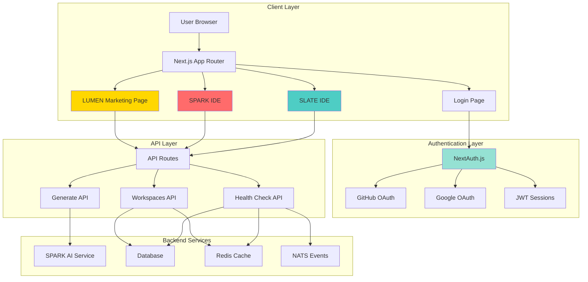

### Component Architecture

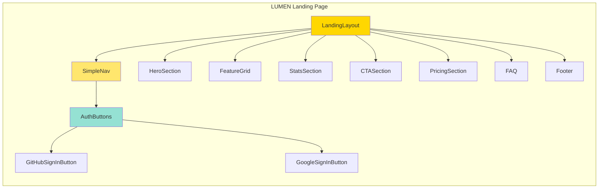

---

## Route Structure & Navigation

### Route Flow Diagram

```mermaid
flowchart TD
    Start([User Visits]) --> Root{/}
    Root -->|Redirect| Lumen[/lumen<br/>Marketing Page]
    
    Lumen --> Nav{User Action}
    Nav -->|Click Login| Login[/login<br/>Authentication]
    Nav -->|Click Templates| Spark[/spark<br/>SPARK IDE]
    Nav -->|Click Editor| Slate[/slate/ide<br/>SLATE IDE]
    Nav -->|Click Docs| Waypoint[/waypoint<br/>Documentation]
    
    Login --> Auth{Choose Provider}
    Auth -->|GitHub| GitHubOAuth[GitHub OAuth]
    Auth -->|Google| GoogleOAuth[Google OAuth]
    
    GitHubOAuth --> Callback[OAuth Callback]
    GoogleOAuth --> Callback
    Callback --> Session[Create Session]
    Session -->|Redirect| Lumen
    
    Spark -->|Requires Auth| AuthCheck{Authenticated?}
    Slate --> AuthCheck
    AuthCheck -->|No| Login
    AuthCheck -->|Yes| Access[Grant Access]
    
    style Lumen fill:#FFD700
    style Login fill:#95E1D3
    style Spark fill:#FF6B6B
    style Slate fill:#4ECDC4
```

### Route Map

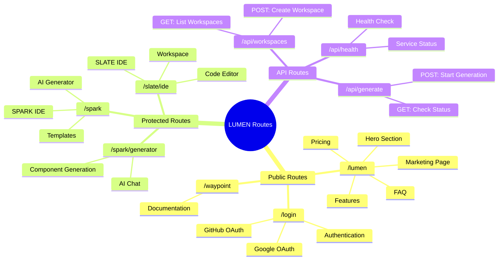

---

## Authentication Flow

### Complete Authentication Flowchart

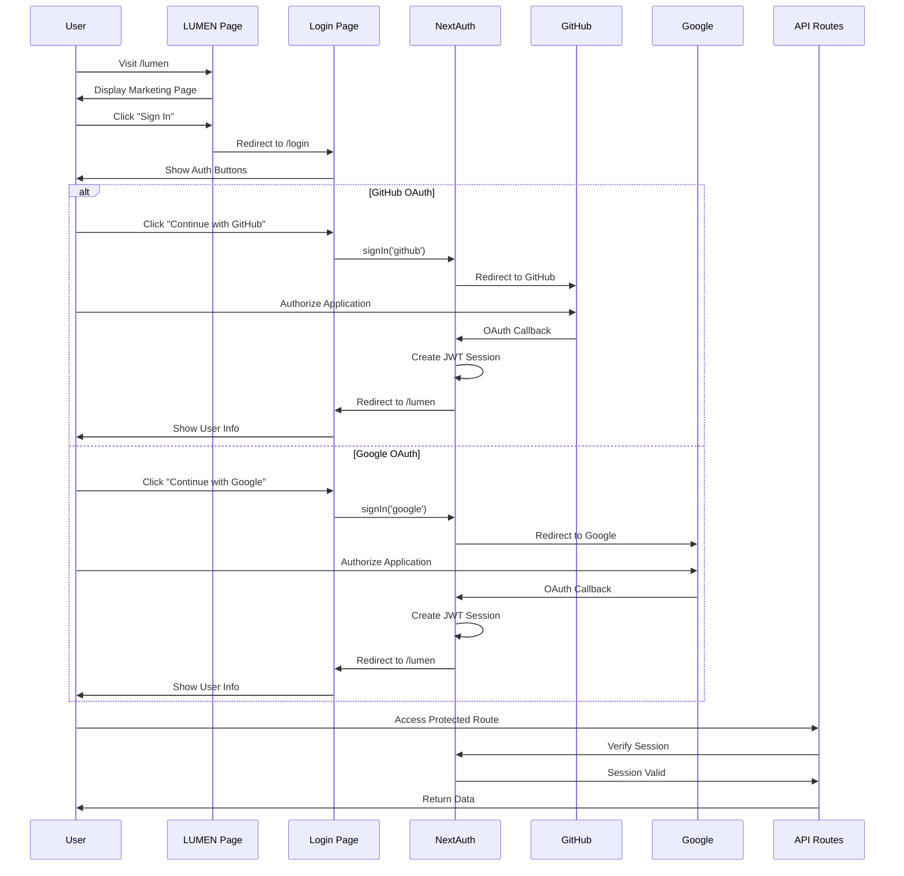

### Authentication State Machine

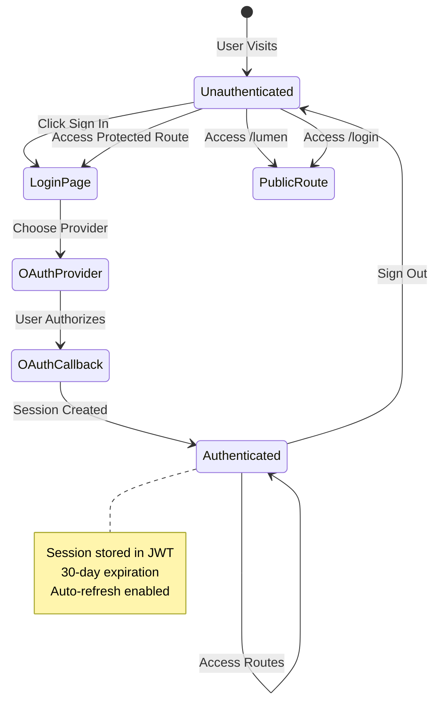

---

## Component Hierarchy

### Landing Page Component Tree

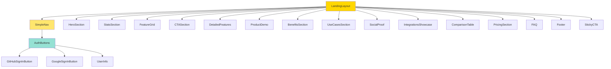

### Navigation Component Structure

```mermaid
graph LR
    A[SimpleNav] --> B[Logo Link]
    A --> C[Navigation Buttons]
    A --> D[AuthButtons]
    
    B --> E[/lumen]
    C --> F[Docs → /waypoint]
    C --> G[Templates → /spark]
    C --> H[Open Editor → /slate/ide]
    
    D --> I{Session Status}
    I -->|Loading| J[Loading Spinner]
    I -->|Authenticated| K[User Avatar + Name]
    I -->|Unauthenticated| L[Sign In Buttons]
    
    K --> M[Sign Out Button]
    L --> N[GitHub Button]
    L --> O[Google Button]
    
    style A fill:#FFE66D
    style D fill:#95E1D3
```

---

## Data Flow Diagrams

### User Data Flow

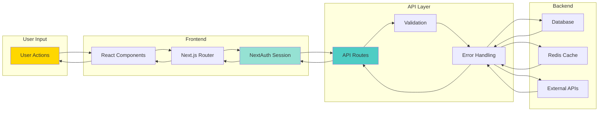

### API Request Flow

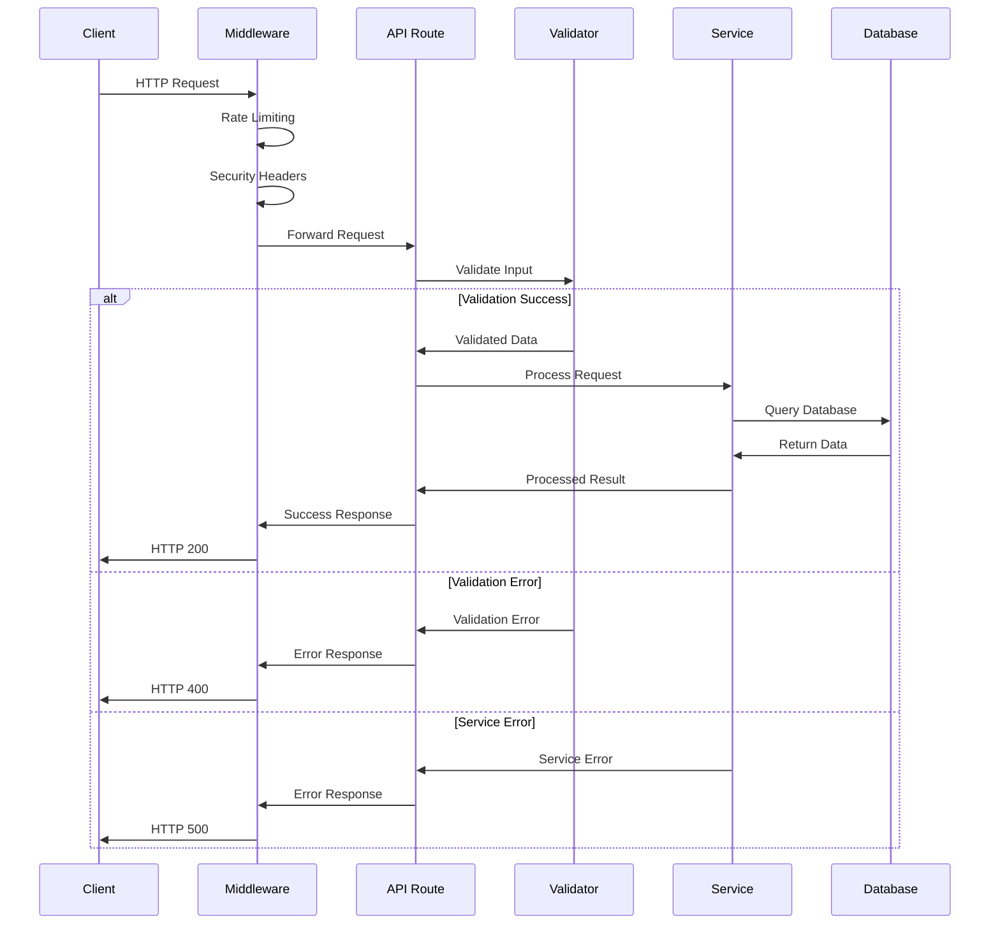

---

## User Journey Maps

### New User Journey

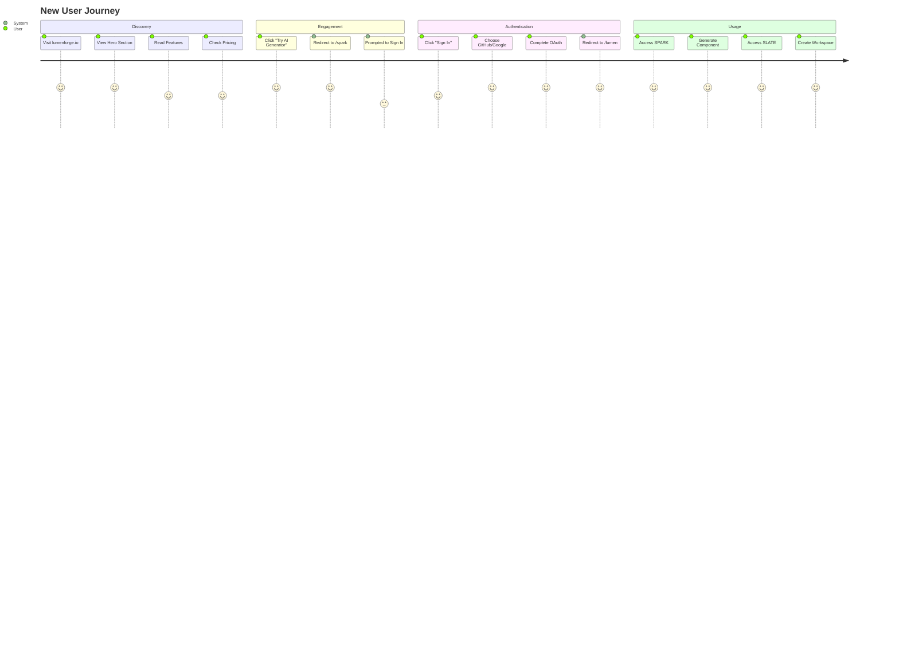

### Returning User Journey

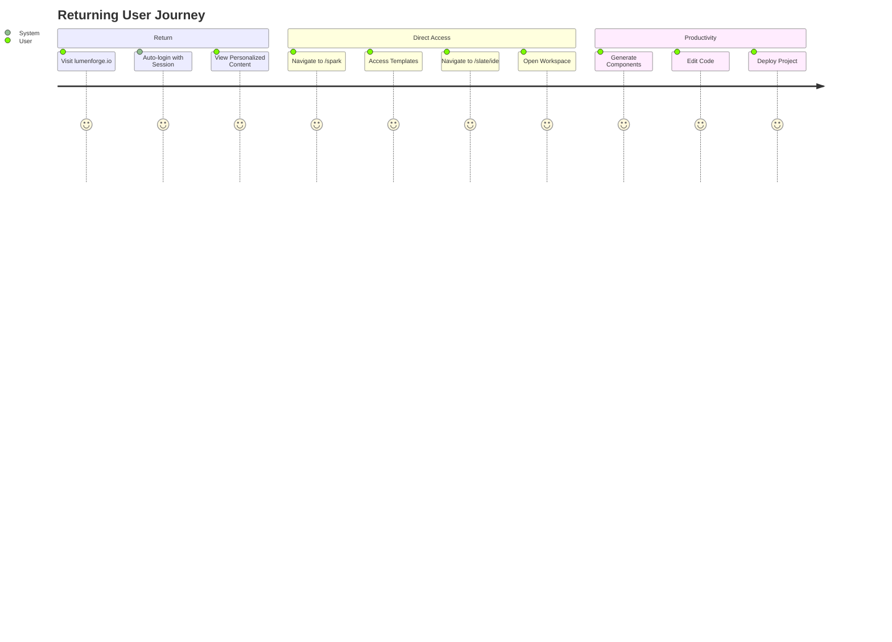

---

## Mind Map

### Complete LUMEN System Mind Map

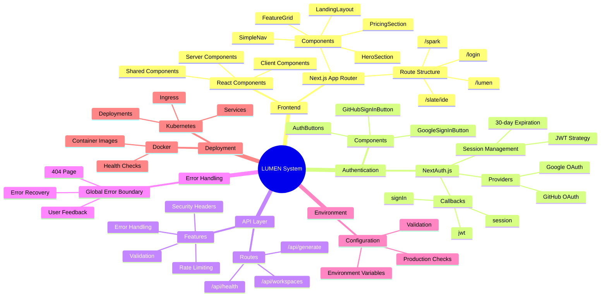

### Feature Mind Map

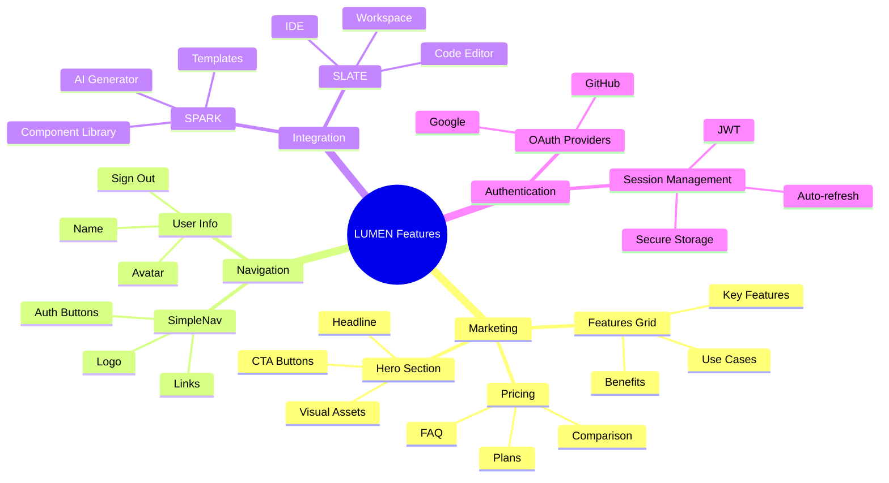

---

## Technical Stack

### Technology Stack Diagram

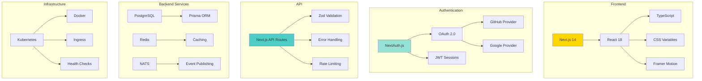

### Dependency Graph

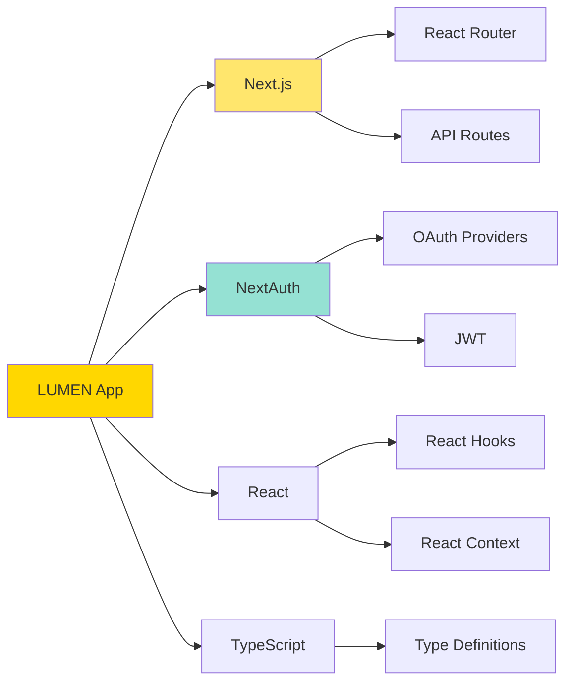

---

## Deployment Architecture

### Kubernetes Deployment Diagram

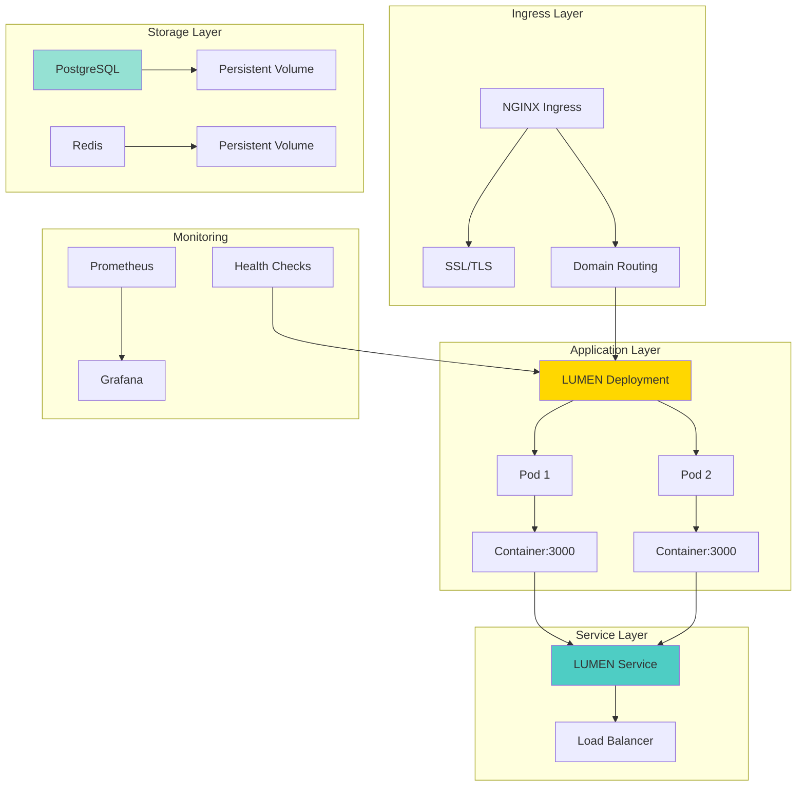

### Deployment Flow

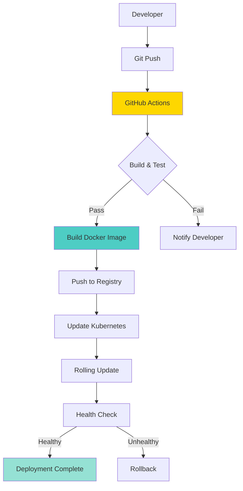

---

## System Metrics & Monitoring

### Health Check Flow

```mermaid
flowchart LR
    A[Kubernetes Probe] --> B[/api/health]
    B --> C{Check Services}
    C --> D[Database]
    C --> E[Redis]
    C --> F[NATS]
    
    D --> G{All Healthy?}
    E --> G
    F --> G
    
    G -->|Yes| H[HTTP 200]
    G -->|No| I[HTTP 503]
    
    H --> J[Pod Ready]
    I --> K[Pod Not Ready]
    
    style B fill:#FFD700
    style H fill:#95E1D3
    style I fill:#FF6B6B
```

### Error Handling Flow

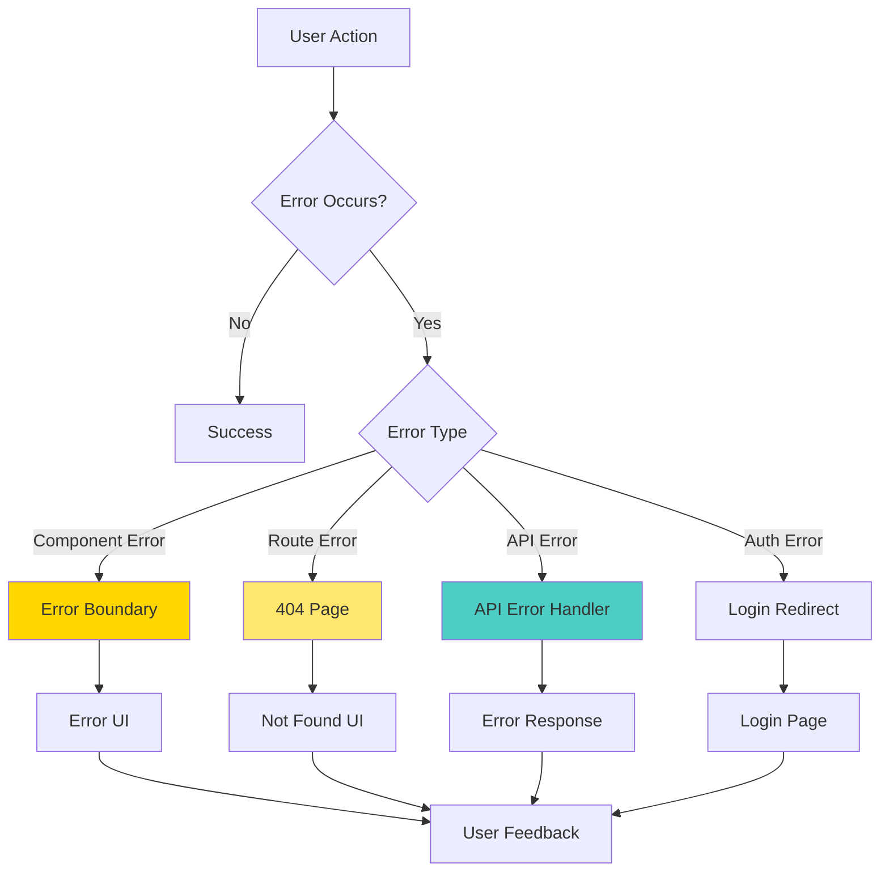

---

## Security Architecture

### Security Layers

```mermaid
graph TB
    subgraph "Network Layer"
        A[HTTPS/TLS] --> B[Cloudflare]
        B --> C[DDoS Protection]
    end
    
    subgraph "Application Layer"
        C --> D[Rate Limiting]
        D --> E[Security Headers]
        E --> F[CORS Policy]
    end
    
    subgraph "Authentication Layer"
        F --> G[OAuth 2.0]
        G --> H[JWT Validation]
        H --> I[Session Management]
    end
    
    subgraph "Data Layer"
        I --> J[Input Validation]
        J --> K[SQL Injection Prevention]
        K --> L[XSS Protection]
    end
    
    style A fill:#FFD700
    style G fill:#95E1D3
    style J fill:#4ECDC4
```

---

## Performance Optimization

### Performance Flow

```mermaid
graph LR
    A[User Request] --> B[CDN Cache]
    B --> C{Cache Hit?}
    C -->|Yes| D[Return Cached]
    C -->|No| E[Next.js Server]
    E --> F[React SSR]
    F --> G[Static Generation]
    G --> H[API Route]
    H --> I[Database Query]
    I --> J[Redis Cache]
    J --> K{Cache Hit?}
    K -->|Yes| L[Return Cached]
    K -->|No| M[Query Database]
    M --> N[Cache Result]
    N --> O[Return Data]
    
    style B fill:#FFD700
    style J fill:#95E1D3
    style M fill:#4ECDC4
```

---

## Conclusion

This comprehensive visual report documents the complete LUMEN system architecture, including:

- ✅ **7 Route Diagrams** - Complete navigation structure
- ✅ **5 Authentication Flows** - OAuth and session management
- ✅ **3 Component Hierarchies** - Frontend structure
- ✅ **4 Data Flow Diagrams** - Request/response flows
- ✅ **2 User Journey Maps** - New and returning users
- ✅ **3 Mind Maps** - System and feature overview
- ✅ **3 Deployment Diagrams** - Kubernetes and CI/CD
- ✅ **2 Security Diagrams** - Security layers and error handling
- ✅ **1 Performance Diagram** - Optimization strategies

**Total Visual Elements:** 30+ diagrams and flowcharts

---

**Report Generated:** December 2024  
**Status:** ✅ Complete Visual Documentation  
**Next Action:** Use this report for onboarding, documentation, and system understanding

