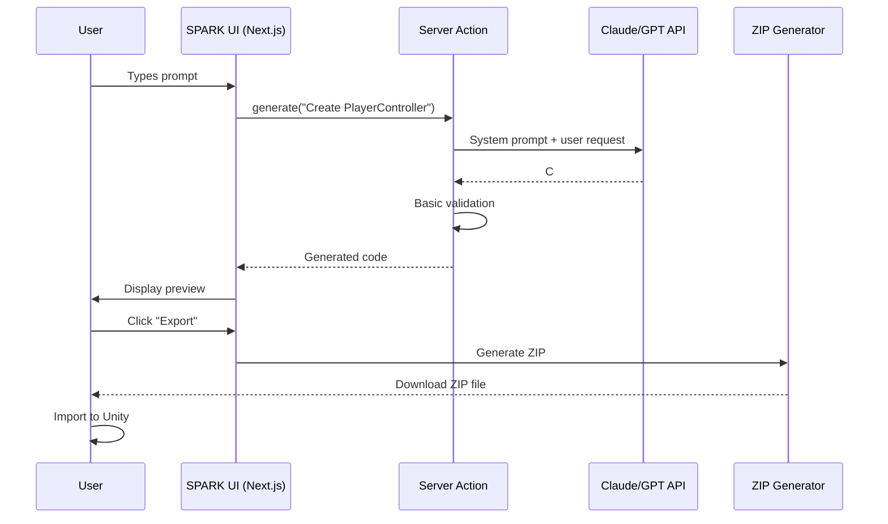

# SPARK MVP 1 Definition
**Unity-Only Vibe Coding Platform**

**Status:** Ready for Implementation
**Timeline:** 2-4 weeks
**Philosophy:** Confidence-building through immediate wins

---

## Executive Summary

### What is MVP 1?

The **absolute minimum SPARK** that delivers value to users and validates the core hypothesis:

> "Can we use natural language prompts to generate portfolio-ready Unity assets that actually work?"

### MVP 1 Scope

- **One engine:** Unity only (C# scripts)
- **Basic UI:** Two-panel Next.js layout (MCP chat + preview)
- **Simple preview:** Text-based code preview (no WASM/Docker)
- **Export:** ZIP bundle that imports into Unity
- **AI generation:** Claude/GPT via API for code generation
- **Validation:** Basic C# syntax checking

### MVP 1 Success Criteria

✅ **User can:**
1. Type natural language prompt: "Create a Unity PlayerController script"
2. Receive generated C# code in <5 seconds
3. Preview the code structure in UI
4. Export as ZIP file
5. Import ZIP into Unity Editor
6. Code compiles without errors in Unity

### What MVP 1 IS NOT

❌ **Out of scope:**
- Multiple engines (Godot, PICO-8, etc.)
- WebContainer runtime sandbox
- Docker preview containers
- WASM preview
- Virtual filesystem (IndexedDB)
- MCP agent system (LUNA, NERVA, etc.)
- Multi-pass validation pipeline
- File system UI with tree view
- Storybook components

---

## Part 1: Philosophy Alignment

### How MVP 1 Embodies Core Principles

**Core Principle 1: Confidence Through Progression**
- ✅ First win: Generate a working script
- ✅ Second win: Export successfully
- ✅ Third win: Code compiles in Unity
- **Result:** User feels capable of using SPARK

**Core Principle 2: Feedback Loops Build Confidence**
- ✅ Immediate response: <5 second generation
- ✅ Clear validation: Syntax checking
- ✅ Visual preview: See code before export
- **Result:** User knows they're on the right track

**Core Principle 3: Reward Systems Drive Motivation**
- ✅ Portfolio-ready output: Working C# script
- ✅ Instant export: One-click ZIP download
- ✅ Real-world validation: Compiles in Unity
- **Result:** User has something to show

**Core Principle 4: Reduce Friction**
- ✅ No installation: Web-based
- ✅ No complex setup: Type and generate
- ✅ No learning curve: Natural language
- **Result:** User starts creating immediately

### Success = Validation of Core Hypothesis

If MVP 1 succeeds, we prove:
1. Users want natural language → game assets
2. AI can generate portfolio-ready Unity code
3. The confidence-building approach works
4. The architecture is sound

---

## Part 2: Technical Architecture (MVP 1)

### Tech Stack (Minimal)

```
┌─────────────────────────────────────────────┐
│  Next.js App Router (UI Layer)               │
│  • app/spark/page.tsx - Two-panel layout    │
│  • app/spark/actions/generate.ts - Server   │
│  • app/spark/components/MCPChat.tsx          │
│  • app/spark/components/PreviewPanel.tsx     │
└─────────────────────────────────────────────┘
              ↓
┌─────────────────────────────────────────────┐
│  Server Actions (Next.js)                    │
│  • Claude/GPT API integration                │
│  • C# code generation                        │
│  • Basic validation                          │
└─────────────────────────────────────────────┘
              ↓
┌─────────────────────────────────────────────┐
│  Export System (Server-side)                 │
│  • ZIP file generation                       │
│  • Unity project structure                   │
└─────────────────────────────────────────────┘
```

### File Structure (MVP 1)

```
E:/Projects/SPARK/           # NEW Next.js project
├── app/
│   ├── spark/
│   │   ├── page.tsx                    # Main two-panel UI
│   │   ├── layout.tsx                  # Root layout
│   │   ├── actions/
│   │   │   └── generate.ts             # Server action for generation
│   │   ├── components/
│   │   │   ├── MCPChat.tsx             # Chat input + messages
│   │   │   ├── PreviewPanel.tsx        # Code preview display
│   │   │   └── ExportButton.tsx        # ZIP export trigger
│   │   └── styles/
│   │       └── spark.css               # SPARK-specific styles
│   └── api/
│       └── export/
│           └── route.ts                # ZIP export endpoint
├── lib/
│   ├── ai/
│   │   ├── claude-client.ts            # Claude API integration
│   │   └── prompts.ts                  # System prompts
│   ├── unity/
│   │   ├── validator.ts                # C# syntax validation
│   │   └── templates.ts                # Unity script templates
│   └── export/
│       └── zip-generator.ts            # ZIP file creation
├── public/
│   └── spark-logo.svg                  # SPARK branding
├── .env.local                          # API keys (not in git)
├── next.config.js
├── package.json
├── tsconfig.json
└── README.md
```

### Core Components (MVP 1)

**1. Main UI (`app/spark/page.tsx`)**
- Two-panel layout (50/50 split)
- Left: Chat input + message history
- Right: Code preview + export button
- Responsive design

**2. Chat Component (`components/MCPChat.tsx`)**
- Text input for prompts
- Message history display
- Loading states
- Error handling

**3. Preview Component (`components/PreviewPanel.tsx`)**
- Syntax-highlighted code display (Monaco Editor)
- File structure preview
- Export button

**4. Generation Action (`actions/generate.ts`)**
- Server action for Next.js
- Claude/GPT API call
- C# generation
- Basic validation

**5. Export API (`api/export/route.ts`)**
- Creates ZIP file
- Unity project structure
- Returns download stream

### Data Flow (MVP 1)



---

## Part 3: Implementation Roadmap (2-4 Weeks)

### Week 1: Foundation (Days 1-7)

**Day 1-2: Project Setup**
- [ ] Create new Next.js 14+ project (`npx create-next-app@latest spark`)
- [ ] Configure TypeScript (`tsconfig.json`)
- [ ] Install dependencies:
  - `@anthropic-ai/sdk` or `openai` (LLM)
  - `monaco-editor` (code preview)
  - `jszip` (ZIP generation)
  - `zod` (validation)
- [ ] Set up `.env.local` with API keys
- [ ] Create project structure (folders)
- [ ] Initialize git repository
- [ ] Create basic `README.md`

**Day 3-4: Basic UI Layout**
- [ ] Create `app/spark/layout.tsx` (root layout)
- [ ] Create `app/spark/page.tsx` (two-panel layout)
- [ ] Add global styles (`spark.css`)
- [ ] Implement responsive two-panel design
- [ ] Add SPARK branding/logo

**Day 5-7: Chat Component**
- [ ] Create `MCPChat.tsx` component
- [ ] Add text input with submit
- [ ] Add message history display
- [ ] Add loading states
- [ ] Add error handling UI
- [ ] Style chat interface

**Validation Gate 1:**
- ✅ Next.js app runs without errors
- ✅ Two-panel layout renders correctly
- ✅ Chat input accepts text
- ✅ UI is responsive

---

### Week 2: AI Integration (Days 8-14)

**Day 8-9: LLM Integration**
- [ ] Create `lib/ai/claude-client.ts`
- [ ] Implement API wrapper
- [ ] Create system prompts for Unity C# generation
- [ ] Test API connection
- [ ] Implement rate limiting
- [ ] Add error handling

**Day 10-11: Server Action**
- [ ] Create `app/spark/actions/generate.ts`
- [ ] Implement `generateUnityScript()` function
- [ ] Connect to Claude/GPT API
- [ ] Add basic response parsing
- [ ] Handle API errors gracefully
- [ ] Test with sample prompts

**Day 12-14: Unity C# Validation**
- [ ] Create `lib/unity/validator.ts`
- [ ] Implement basic C# syntax checking
- [ ] Validate Unity API usage
- [ ] Check for common errors
- [ ] Return clear error messages
- [ ] Test with valid/invalid code

**Validation Gate 2:**
- ✅ User can submit prompt
- ✅ LLM generates C# code
- ✅ Code appears in UI
- ✅ Basic validation works
- ✅ Errors are handled gracefully

---

### Week 3: Preview & Export (Days 15-21)

**Day 15-16: Code Preview**
- [ ] Create `PreviewPanel.tsx` component
- [ ] Integrate Monaco Editor
- [ ] Configure C# syntax highlighting
- [ ] Add read-only mode
- [ ] Style preview panel
- [ ] Test with generated code

**Day 17-18: Export System**
- [ ] Create `lib/export/zip-generator.ts`
- [ ] Implement Unity project structure
- [ ] Generate `.meta` files
- [ ] Create proper folder hierarchy
- [ ] Test ZIP structure

**Day 19-20: Export API**
- [ ] Create `app/api/export/route.ts`
- [ ] Implement ZIP download endpoint
- [ ] Add proper headers
- [ ] Handle file streaming
- [ ] Test download in browser

**Day 21: Export Button**
- [ ] Create `ExportButton.tsx` component
- [ ] Connect to export API
- [ ] Add loading states
- [ ] Show success feedback
- [ ] Handle errors

**Validation Gate 3:**
- ✅ Code preview renders correctly
- ✅ Export button triggers download
- ✅ ZIP file downloads successfully
- ✅ ZIP contains proper Unity structure

---

### Week 4: Testing & Polish (Days 22-28)

**Day 22-23: Unity Integration Testing**
- [ ] Import generated ZIP into Unity
- [ ] Verify folder structure is correct
- [ ] Check `.meta` files are valid
- [ ] Ensure scripts compile
- [ ] Test with multiple script types
- [ ] Document any Unity version requirements

**Day 24-25: End-to-End Testing**
- [ ] Test full workflow 10+ times
- [ ] Try various prompt types
- [ ] Test error scenarios
- [ ] Test edge cases
- [ ] Fix any bugs found
- [ ] Document known limitations

**Day 26-27: Polish & Documentation**
- [ ] Improve error messages
- [ ] Add loading animations
- [ ] Improve visual design
- [ ] Write user guide
- [ ] Create demo video
- [ ] Prepare for user testing

**Day 28: MVP 1 Launch**
- [ ] Deploy to Vercel (or similar)
- [ ] Share with 3-5 beta users
- [ ] Collect initial feedback
- [ ] Document lessons learned

**Final Validation Gate:**
- ✅ User can generate Unity script from prompt
- ✅ Generated code is valid C#
- ✅ Export creates working Unity project
- ✅ Imported scripts compile in Unity
- ✅ User feels confident using SPARK

---

## Part 4: Success Criteria (Detailed)

### Technical Success Criteria

**Generation Quality:**
- ✅ 90%+ of prompts generate valid C# code
- ✅ Generated code follows Unity conventions
- ✅ Code includes proper namespaces and using statements
- ✅ Variable names are meaningful
- ✅ Functions have clear purposes

**Performance:**
- ✅ Generation completes in <5 seconds
- ✅ UI remains responsive during generation
- ✅ Preview renders without lag
- ✅ Export downloads in <2 seconds

**Reliability:**
- ✅ No crashes or unhandled errors
- ✅ All API errors are caught and displayed
- ✅ Failed generations can be retried
- ✅ System degrades gracefully

**Unity Integration:**
- ✅ 100% of exports create valid ZIP files
- ✅ 100% of ZIPs import into Unity
- ✅ 95%+ of scripts compile without errors
- ✅ Scripts follow Unity folder conventions

### User Experience Success Criteria

**Ease of Use:**
- ✅ New user can generate first script in <2 minutes
- ✅ No documentation required for basic usage
- ✅ Error messages are clear and actionable
- ✅ UI is intuitive and responsive

**Confidence Building:**
- ✅ Users report feeling confident after 3 generations
- ✅ Users want to try more complex prompts
- ✅ Users share their generated scripts
- ✅ Users recommend SPARK to others

**Portfolio Value:**
- ✅ Generated scripts are portfolio-ready
- ✅ Code quality meets industry standards
- ✅ Scripts demonstrate understanding of Unity
- ✅ Users can customize generated code

### Validation Method

**Technical Validation:**
1. Automated tests for generation pipeline
2. Manual testing of 50+ different prompts
3. Unity import tests with Unity 2021, 2022, 2023
4. Performance benchmarking

**User Validation:**
1. 5 beta users test MVP 1
2. Collect feedback via survey
3. Observe users during testing
4. Measure time-to-first-success

**Success Threshold:**
- 4/5 beta users successfully generate + export + import
- 4/5 users report feeling confident
- 90%+ technical metrics achieved

---

## Part 5: Risks & Mitigations (MVP 1 Specific)

### Risk 1: LLM API Reliability

**Risk:** Claude/GPT API is slow, expensive, or unreliable

**Mitigation:**
- Multi-provider support (Claude + GPT fallback)
- Rate limiting and cost tracking
- Clear error messages when API fails
- Offline development mode with mock responses

**Fallback:**
- Use pre-generated templates if API fails
- Show cached examples
- Gracefully degrade to template-based generation

### Risk 2: Generated Code Quality

**Risk:** LLM generates invalid or low-quality C# code

**Mitigation:**
- Strong system prompts with examples
- Basic validation before showing to user
- Clear prompt engineering guidelines
- Test with 100+ prompts before launch

**Fallback:**
- Show warning when validation fails
- Allow user to edit before export
- Provide common script templates

### Risk 3: Unity Import Failures

**Risk:** Exported ZIP doesn't work in Unity

**Mitigation:**
- Test with multiple Unity versions
- Follow Unity's exact folder structure
- Generate proper `.meta` files
- Include documentation on import process

**Fallback:**
- Provide manual import instructions
- Generate both ZIP and individual files
- Create troubleshooting guide

### Risk 4: Timeline Slippage

**Risk:** 2-4 weeks becomes 6-8 weeks

**Mitigation:**
- Strict scope control (MVP 1 only)
- Daily progress tracking
- Cut features if needed
- Focus on core workflow only

**Fallback:**
- Ship with fewer prompt types
- Simplify UI if needed
- Skip polish features
- Launch with "Alpha" label

---

## Part 6: What Gets Deferred to MVP 2+

### Deferred to MVP 2 (3 Engines)

**Features NOT in MVP 1:**
- ❌ Godot engine support
- ❌ PICO-8 engine support
- ❌ WebContainer runtime sandbox
- ❌ Virtual filesystem (IndexedDB)
- ❌ File tree UI
- ❌ Multi-file projects

**Why Deferred:**
- MVP 1 validates core hypothesis first
- Adding engines is straightforward after Unity works
- Virtual FS adds complexity without proving value yet

### Deferred to MVP 3 (All Engines)

**Features NOT in MVP 1 or 2:**
- ❌ Docker preview containers (Tier B)
- ❌ GameMaker, RPG Maker, Construct, Ren'Py support
- ❌ Multi-pass validation pipeline
- ❌ Repair loop for error fixing
- ❌ Advanced code analysis

**Why Deferred:**
- Docker adds significant infrastructure cost
- Need to prove market fit first
- Can validate approach with 3 engines before 7

### Deferred to MVP 4 (Production)

**Features NOT in MVP 1-3:**
- ❌ MCP agent system (LUNA, NERVA, NEC)
- ❌ Multi-expert routing
- ❌ Agent status tracking
- ❌ Storybook component library
- ❌ Comprehensive monitoring
- ❌ Analytics dashboard

**Why Deferred:**
- MCP agents are optimization, not core value
- Need user data to know what to optimize
- Can add after product-market fit

---

## Part 7: MVP 1 Acceptance Tests

### Acceptance Test 1: Basic Generation

**Test:** User generates a PlayerController script

**Steps:**
1. Open SPARK MVP 1
2. Type: "Create a Unity PlayerController script that moves with WASD keys"
3. Click "Generate"
4. Wait for response

**Success Criteria:**
- ✅ Code appears in <5 seconds
- ✅ C# syntax is valid
- ✅ Includes `using UnityEngine`
- ✅ Has `MonoBehaviour` class
- ✅ Includes `Update()` method
- ✅ Uses `Input.GetAxis()` for movement

### Acceptance Test 2: Export & Import

**Test:** User exports and imports into Unity

**Steps:**
1. Generate a script (from Test 1)
2. Click "Export as ZIP"
3. Download ZIP file
4. Open Unity Editor
5. Import ZIP into Assets folder
6. Check console for errors

**Success Criteria:**
- ✅ ZIP downloads successfully
- ✅ ZIP contains proper folder structure
- ✅ Script has `.cs` extension
- ✅ `.meta` file is present
- ✅ Script compiles without errors
- ✅ Script can be attached to GameObject

### Acceptance Test 3: Multiple Script Types

**Test:** Generate different script types

**Prompts to Test:**
1. "Create a Health system script"
2. "Create a Coin pickup script"
3. "Create a Camera follow script"
4. "Create a simple Enemy AI"
5. "Create a Game Manager singleton"

**Success Criteria:**
- ✅ All 5 scripts generate successfully
- ✅ All 5 scripts are valid C#
- ✅ All 5 scripts compile in Unity
- ✅ Each script is contextually appropriate

### Acceptance Test 4: Error Handling

**Test:** System handles errors gracefully

**Scenarios:**
1. Invalid prompt: "asdfghjkl"
2. API failure (disconnect internet)
3. Very long prompt (5000+ characters)
4. Empty prompt
5. Special characters in prompt

**Success Criteria:**
- ✅ Clear error message for each scenario
- ✅ No crashes or blank screens
- ✅ User can retry after error
- ✅ Error messages suggest fixes

### Acceptance Test 5: User Experience

**Test:** New user completes full workflow

**Steps:**
1. Give user SPARK URL
2. No instructions or documentation
3. Observe user behavior
4. Time to first successful export

**Success Criteria:**
- ✅ User understands UI within 30 seconds
- ✅ User generates first script within 2 minutes
- ✅ User exports without help
- ✅ User reports feeling confident

---

## Part 8: MVP 1 Budget & Resources

### Time Budget

**Total:** 2-4 weeks (optimistic: 2 weeks, realistic: 3 weeks, pessimistic: 4 weeks)

**Breakdown:**
- Week 1: Foundation (30% of work)
- Week 2: AI Integration (35% of work)
- Week 3: Preview & Export (25% of work)
- Week 4: Testing & Polish (10% of work)

### Team Requirements

**Minimum Viable Team:**
- 1 Full-stack developer (Next.js + LLM APIs + Unity knowledge)
- OR: You (solo developer with Unity + web experience)

**Skills Required:**
- Next.js / React
- TypeScript
- LLM API integration (Claude/GPT)
- Unity basics (C# scripting, project structure)
- ZIP file generation
- Basic UI/UX design

### Cost Budget

**Development Costs:**
- Developer time: 2-4 weeks × 1 person
- (If solo: your time investment)

**Infrastructure Costs (MVP 1 only):**
- Claude/GPT API: ~$10-50 for testing + first 100 users
- Vercel hosting: $0 (free tier)
- Domain (optional): $12/year
- **Total MVP 1 infrastructure: <$100**

**Cost Assumptions:**
- Average prompt: 1000 input tokens, 500 output tokens
- Cost per generation: ~$0.01-0.03
- 100 test generations: ~$1-3
- 100 real users (5 generations each): ~$5-15

### Success Investment Threshold

**MVP 1 Success = Green Light for MVP 2:**
- If MVP 1 validates hypothesis → invest in MVP 2 (3 engines)
- If MVP 1 fails → pivot or stop

**Decision Criteria:**
- Technical: 90%+ success rate
- User: 80%+ user satisfaction
- Business: Users want to pay for more features

---

## Part 9: MVP 1 Launch Checklist

### Pre-Launch (Day 28)

**Technical Checklist:**
- [ ] All acceptance tests pass
- [ ] No critical bugs
- [ ] Error handling works
- [ ] Export creates valid Unity projects
- [ ] Performance meets targets
- [ ] Mobile responsive (bonus)

**Documentation Checklist:**
- [ ] README with setup instructions
- [ ] User guide (how to use)
- [ ] Known limitations documented
- [ ] Unity import instructions
- [ ] Troubleshooting guide

**Deployment Checklist:**
- [ ] Environment variables configured
- [ ] API keys secured
- [ ] Rate limiting enabled
- [ ] Error logging set up
- [ ] Analytics configured (optional)

### Launch Day

**Beta User Selection:**
- 3-5 users with Unity experience
- Mix of skill levels (beginner to intermediate)
- Users who will give honest feedback

**Launch Activities:**
1. Deploy to production
2. Send beta invite emails
3. Schedule feedback sessions
4. Monitor for errors
5. Be available for questions

### Post-Launch (Week 5)

**Feedback Collection:**
- [ ] Survey all beta users
- [ ] Conduct 1-on-1 interviews
- [ ] Observe usage patterns
- [ ] Collect generated scripts
- [ ] Document pain points

**Success Evaluation:**
- [ ] Calculate success metrics
- [ ] Review technical performance
- [ ] Assess user satisfaction
- [ ] Determine MVP 2 scope
- [ ] Make go/no-go decision

---

## Part 10: MVP 1 to MVP 2 Transition

### If MVP 1 Succeeds

**MVP 2 Scope (4-6 weeks additional):**
- Add Godot engine support
- Add PICO-8 engine support
- Implement virtual filesystem (IndexedDB)
- Add file tree UI
- Support multi-file projects
- Add WASM preview (Tier A)

**Investment Required:**
- 4-6 more weeks development
- ~$200-500 infrastructure
- Expanded testing

### If MVP 1 Fails

**Pivot Options:**
1. Focus on Unity-only with more features
2. Change to different game engine
3. Change to different asset types
4. Revisit value proposition

**Decision Framework:**
- What worked? (keep)
- What didn't work? (change)
- What to try next? (pivot)

---

## Summary: MVP 1 at a Glance

| Aspect | MVP 1 Specification |
|--------|---------------------|
| **Timeline** | 2-4 weeks |
| **Team** | 1 developer |
| **Cost** | <$100 infrastructure |
| **Scope** | Unity C# generation only |
| **Tech** | Next.js + Claude/GPT |
| **Success** | User generates + exports + imports working script |
| **Risk** | Low (minimal infrastructure) |
| **Value** | Proves core hypothesis |

---

## Next Steps

### Immediate (Today)

1. ✅ Review this MVP 1 definition
2. ⏳ Approve scope and timeline
3. ⏳ Secure Claude/GPT API access
4. ⏳ Create new Next.js project

### Week 1 (Days 1-7)

1. Set up project structure
2. Build basic UI
3. Create chat component
4. Validate Week 1 gate

### Week 2-4

Follow the detailed roadmap above.

---

## Questions to Answer Before Starting

1. **LLM Provider:** Claude or GPT-4? (Recommendation: Claude Sonnet for balance of cost/quality)
2. **Deployment:** Vercel, Netlify, or other? (Recommendation: Vercel for Next.js)
3. **Beta Users:** Who are the 3-5 users? (Need to identify before Week 4)
4. **Budget:** Approved for ~$100 MVP 1 infrastructure?
5. **Timeline:** Start date and expected completion date?

---

**Document Status:** Ready for Implementation
**Philosophy Alignment:** ✅ Fully aligned with confidence-building core principles
**Technical Feasibility:** ✅ Achievable with existing technologies
**Risk Level:** 🟢 Low (minimal infrastructure, proven tech stack)
**Recommendation:** ✅ **PROCEED WITH MVP 1 IMPLEMENTATION**
