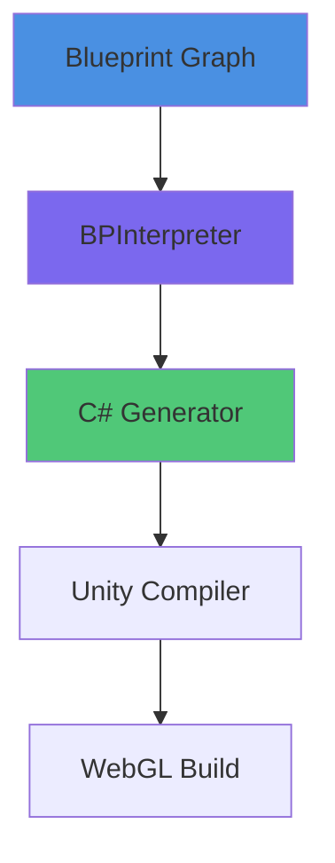

import { Meta, Story, Canvas } from '@storybook/addon-docs';
import { GraphDemo } from '../../.storybook/docs-components/InteractiveGraph';
import { LinkCard } from '../../.storybook/docs-components/LinkCard';
import { UnityRuntimePreview } from '../../.storybook/docs-components/UnityRuntimePreview';
import { LunaGeneratedExample } from '../../.storybook/docs-components/LunaGeneratedExample';

<Meta title="Examples/Interactive Components" />

# Interactive Documentation Examples

## Live Blueprint Graph

<GraphDemo 
  graph={{
    id: "example-graph",
    name: "Example Graph",
    nodes: {},
    connections: {}
  }} 
  readOnly 
/>

## Unity WebGL Runtime

<UnityRuntimePreview 
  buildUrl="/unity-builds/sample/index.html"
  height="600px"
/>

## Cross-Subsystem Links

<LinkCard 
  href="/?path=/docs/ignis--docs" 
  title="Ignis Blueprint Editor"
  description="Learn about the visual scripting system."
  icon="🔷"
/>

<LinkCard 
  href="/?path=/docs/spark--docs" 
  title="Spark Templates"
  description="Explore pre-built template graphs."
  icon="✨"
/>

## Mermaid Diagrams

## LUNA AI Generation

<LunaGeneratedExample 
  prompt="Explain how Blueprint events trigger Unity runtime C# code."
/>

