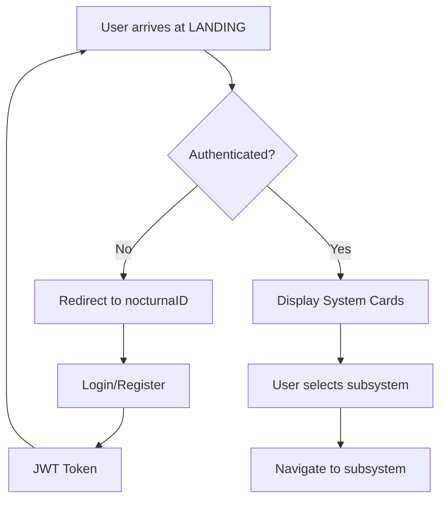

import { Meta } from '@storybook/blocks';

<Meta title="WISSIL/Landing/Documentation" />

# LANDING - Main Gateway

The **LANDING** subsystem serves as the primary entry point and navigation hub for the entire WISSIL ecosystem.

## Purpose

LANDING provides a unified interface for:
- **System Overview**: Quick access to all 6 WISSIL subsystems
- **Navigation Hub**: Direct routing to specialized tools
- **Status Dashboard**: Real-time health monitoring
- **Quick Actions**: Common tasks and workflows

## Architecture

### Component Hierarchy

```
LandingPage
├── Hero Section
│   ├── System Badge
│   ├── Main Heading (WISSIL)
│   ├── Description
│   └── CTA Buttons
├── Systems Grid
│   ├── SLATE Card
│   ├── IGNITION Card
│   ├── SPARK Card
│   ├── IGNIS Card
│   └── WAYPOINT Card
└── Features Section
    ├── Lightning Fast
    ├── AI-Powered
    └── Fully Integrated
```

### Network Topology

- **Location**: Helios Control (192.168.86.114)
- **Port**: 3000
- **Protocol**: HTTPS
- **Auth**: nocturnaID integration
- **Access**: Public facing

## Design System

### Color Palette

The LANDING subsystem uses the following SLATE tokens:

| Token | Value | Usage |
|-------|-------|-------|
| `landing-primary` | #FFD700 | Primary actions, headings |
| `landing-secondary` | #1E3A8A | Secondary elements |
| `landing-accent` | #F59E0B | Highlights, hover states |
| `landing-gradient` | Gold → Amber | Hero backgrounds, CTAs |

### Typography

- **Headings**: Space Grotesk, Bold (72px - 96px)
- **Body**: Inter, Regular/Medium (16px - 20px)
- **Monospace**: JetBrains Mono (System info)

### Spacing

- Section padding: `py-20 sm:py-32`
- Card gap: `gap-6`
- Container: `max-w-5xl` (Hero), `max-w-6xl` (Grid)

## Interactive Elements

### System Cards

Each subsystem card includes:
- **Icon**: Lucide icon with system color
- **Name**: Bold, system-colored heading
- **Status Badge**: Real-time health indicator
- **Description**: Brief explanation of purpose
- **Link**: Hover effect with arrow animation

### Animation Effects

1. **Floating Orbs**: 6-second float animation with staggered delays
2. **Card Hover**: -8px translateY + shadow enhancement
3. **CTA Buttons**: Scale transform (1.05) on hover
4. **Arrow Icons**: translateX on parent hover

## Responsive Design

### Breakpoints

- **Mobile** (< 640px): Single column, reduced spacing
- **Tablet** (640px - 1024px): 2-column grid
- **Desktop** (1024px+): 3-column grid

### Mobile Optimizations

- Reduced font sizes (6xl → 5xl)
- Stacked CTA buttons
- Simplified animation effects
- Touch-optimized card sizing

## Integration Points

### Authentication

```typescript
// nocturnaID integration
endpoint: /auth/login
roles: ['Designer', 'Engineer', 'Admin', 'Agent']
flow: Cloudflare Zero Trust → nocturnaID → JWT
```

### Navigation

- Direct routing to all WISSIL subsystems
- Programmatic navigation via Next.js Link
- State preservation across navigation

### MCP Tools

- `mcp_luminera_read_component`: Read component definitions
- `mcp_vfs_read`: Access file system data

## User Flow



## Performance Metrics

- **Initial Load**: < 1.5s (optimized bundle)
- **Time to Interactive**: < 2s
- **Lighthouse Score**: 95+ (Performance, Accessibility)
- **Bundle Size**: ~180 KB (gzipped)

## Accessibility

### WCAG AA+ Compliance

- ✅ Semantic HTML structure
- ✅ ARIA labels on interactive elements
- ✅ Keyboard navigation support
- ✅ Focus indicators on all controls
- ✅ Sufficient color contrast (4.5:1+)
- ✅ Screen reader tested

### Keyboard Shortcuts

- `Tab`: Navigate between cards
- `Enter/Space`: Activate card link
- `Esc`: Close modal dialogs

## Best Practices

1. **Performance**: Lazy load system cards below the fold
2. **SEO**: Dynamic meta tags based on user state
3. **Analytics**: Track system selection and user paths
4. **Error Handling**: Graceful fallbacks for offline mode
5. **Loading States**: Skeleton screens during initial load

## Related Subsystems

- **SLATE**: Provides design tokens and theming
- **IGNITION**: Used for new project initialization
- **WAYPOINT**: Manages deployment of LANDING page
