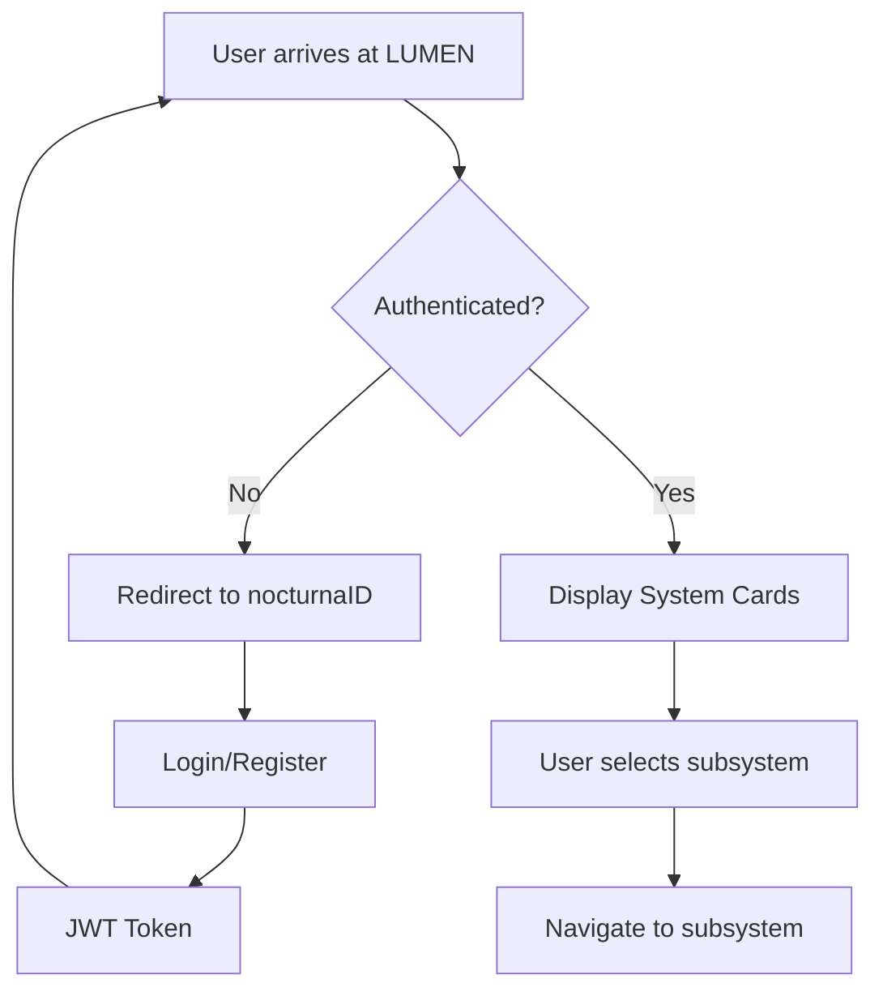

import { Meta } from '@storybook/addon-docs/blocks';

<Meta
  title="Lumenforge.io Design System/WIS2L Framework/Landing/Documentation/Landing"
  id="wis2l-landing-docs-stories"
  name="Landing WIS2L Docs"
/>

# LUMEN - Main Gateway

The **LUMEN** subsystem is the primary entry point into the WISSIL ecosystem and the marketing surface for **Lumenforge.io**.
It introduces the value of the platform, then routes users into the individual subsystems (SLATE, SPARK, IGNITION, IGNIS, WAYPOINT).

The current hero copy is:

> **Your Entire Creative Pipeline in One Workspace**  
> Lumenforge.io unifies AI generation, design tokens, blueprint editing, live previews, and deployment into a single, high-velocity development environment built for modern teams.

## Purpose

LUMEN provides a unified interface for:
- **Product Story**: Explain what Lumenforge.io is and why it exists
- **Navigation Hub**: Route into SPARK, SLATE, IGNITION, IGNIS, WAYPOINT
- **Conversion Surface**: Capture signups, free trials, and demo requests
- **System Overview**: Communicate the capabilities of the full **WIS2L** stack

## Architecture

### Component Hierarchy (Current Implementation)

The canonical React composition lives in `src/wissil/Landing/LandingLayout.tsx`:

```
LandingLayout
├── SimpleNav
├── HeroSection
├── StatsSection
├── FeatureGrid
├── CTASection (mid-page)
├── DetailedFeatures
├── ProductDemo
├── BenefitsSection
├── UseCasesSection
├── SocialProof
├── IntegrationsShowcase
├── ComparisonTable
├── PricingSection
├── FAQ
├── CTASection (end-of-page)
├── Footer
└── StickyCTA
```

- **SimpleNav** – Top navigation with Docs + Open Editor
- **HeroSection** – Lumenforge.io hero copy + primary CTAs (Start Coding / Try AI Generator)
- **StatsSection** – Key metrics (developers, projects, lines of code, uptime)
- **FeatureGrid** – 3 core feature cards (Instant Preview, Clean Project Explorer, Code-First Workflow)
- **DetailedFeatures** – 8 deeper feature explanations with benefits
- **ProductDemo** – Video/demo slot and screenshot grid
- **BenefitsSection** – ROI-focused messaging and key outcomes
- **UseCasesSection** – “Perfect for teams like yours” by industry/use case
- **SocialProof** – Testimonials, user counts, logos
- **IntegrationsShowcase** – Logos for GitHub, Unity, Vercel, etc.
- **ComparisonTable** – Lumenforge vs Bolt.new, StackBlitz, CodeSandbox
- **PricingSection** – Free/Pro/Enterprise tiers
- **FAQ** – 10 questions, accessible accordion
- **CTASection / StickyCTA** – Mid-page, end-of-page, and sticky CTAs for conversion
- **Footer** – Newsletter, navigation, legal, social links

### Network Topology

- **Location**: Helios Control (192.168.86.114)
- **Port**: 3000
- **Protocol**: HTTPS
- **Auth**: nocturnaID integration
- **Access**: Public facing

## Design System

### Color Palette

The LUMEN subsystem uses the following SLATE tokens:

| Token | Value | Usage |
|-------|-------|-------|
| `landing-primary` | #FFD700 | Primary actions, headings |
| `landing-secondary` | #1E3A8A | Secondary elements |
| `landing-accent` | #F59E0B | Highlights, hover states |
| `landing-gradient` | Gold → Amber | Hero backgrounds, CTAs |

### Typography

- **Headings**: Space Grotesk, Bold (72px - 96px)
- **Body**: Inter, Regular/Medium (16px - 20px)
- **Monospace**: JetBrains Mono (System info)

### Spacing

- Section padding: `py-20 sm:py-32`
- Card gap: `gap-6`
- Container: `max-w-5xl` (Hero), `max-w-6xl` (Grid)

## Interactive Elements

### Primary CTAs

The hero section exposes two primary calls to action:
- **Start Coding** → `/slate/ide` (opens the SLATE IDE experience)
- **Try AI Generator** → `/spark` (opens the SPARK AI component generator)

Additional CTAs appear mid-page, at the end of the page, and in a sticky bar:
- **Start Coding Now** (accent CTA section)
- **Get Started Free** / **Schedule Demo** (end-of-page CTA)
- **Sticky CTA** that appears after scroll for persistent conversion.

### Feature & Content Sections

- **Feature Cards** – Each card highlights a core workflow (preview, project explorer, code-first workflow).
- **Detailed Feature Lists** – Bullet lists explaining concrete benefits.
- **Use Cases** – Chips/tags for industries and team types.
- **Stats** – Large-number metrics for social proof.

### Animation & Interaction Effects

Animations are deliberately subtle to keep readability high:
1. CTA hover states (scale + color shifts via design tokens)
2. Card hover elevation and subtle transforms
3. Sticky CTA reveal based on scroll position

All interactions are covered by Storybook `play` functions so they are testable and reproducible.

## Responsive Design

### Breakpoints

- **Mobile** (< 640px): Single column, reduced spacing
- **Tablet** (640px - 1024px): 2-column grid
- **Desktop** (1024px+): 3-column grid

### Mobile Optimizations

- Reduced font sizes (6xl → 5xl)
- Stacked CTA buttons
- Simplified animation effects
- Touch-optimized card sizing

## Integration Points

### Authentication

The production deployment still sits behind **Cloudflare Zero Trust + nocturnaID** for authenticated environments, but the **marketing landing** itself is publicly accessible.

```typescript
// nocturnaID integration (protected surfaces)
endpoint: /auth/login
roles: ['Designer', 'Engineer', 'Admin', 'Agent']
flow: Cloudflare Zero Trust → nocturnaID → JWT
```

### Navigation

- Top nav routes users into **Docs** and **SLATE IDE**.
- Hero CTAs route into **SLATE** and **SPARK**.
- Footer links expose About, Docs, Templates (IGNITION), and other key pages.

### Storybook & Agents

- Storybook exposes multiple views of the landing experience:
  - `WIS2L Framework/Landing/Pages/Main Gateway` – Next.js-based landing page (`src/app/lumen/page.tsx` → `LandingLayout`).
  - `WIS2L Framework/Landing/Shared Framework Components/Interactive Landing` – Minimal interactive shell (Nav + Hero + Features + Footer).
  - `WIS2L Framework/Landing/Shared Framework Components/LandingComponents` – Full `LandingLayout` with all sections.
  - `Lumenforge.io / Landing / Pages / ProductionLanding` – The Vite app from `src/apps/lumenforge-landing/App.tsx` rendered inside Storybook.
- External agents (Playwright, MCP, etc.) should prefer the **ProductionLanding** story or the Vite app directly; see `docs/LANDING_AGENT_REFERENCE.md` for precise instructions.

## User Flow



## Performance Metrics

The landing page is designed to be light and fast:

- **Initial Load Target**: < 1.5s (on typical broadband)
- **Time to Interactive Target**: < 2s
- **Key Optimizations**:
  - Minimal above-the-fold JavaScript
  - Shared design tokens between Next.js app, Storybook, and Vite app
  - Ready for image/video lazy loading

## Accessibility

### WCAG AA+ Goals

- ✅ Semantic HTML structure (`section`, `nav`, `footer`, `article`)
- ✅ ARIA attributes on interactive controls where needed
- ✅ Keyboard navigation support across all CTAs and FAQ accordions
- ✅ Visible focus indicators for buttons/links
- ✅ Contrast tuned with design tokens and verified via Storybook A11y panel

Interactive stories (`Main Gateway`, `Interactive Landing`, `LandingComponents`) include `play` functions that:
- Walk the page via keyboard
- Click through all CTAs
- Exercise the FAQ accordion
- Scroll through the full layout

## Best Practices

1. **Performance**: Keep heavy media (videos, large images) lazy-loaded and below the fold.
2. **SEO**: Mirror meta tags and OG data from `apps/lumenforge-landing/index.html`.
3. **Analytics**: Track hero CTAs, mid-page CTAs, pricing clicks, and StickyCTA dismissals.
4. **Error Handling**: Provide graceful fallbacks for content/API failures (e.g., default copy, disabled CTAs).
5. **Loading States**: Use skeletons or graceful placeholders for any async-loaded sections.

## Related Subsystems

- **SLATE**: Design system + IDE surface; primary target for \"Open Editor\" CTAs.
- **SPARK**: AI component generator; primary target for \"Try AI Generator\" CTAs.
- **IGNITION**: Project scaffolding; linked from Templates/Project Templates flows.
- **IGNIS**: Build/runtime pipeline surfaced from marketing copy and deeper docs.
- **WAYPOINT**: Manages deployment of the landing page and downstream apps.
